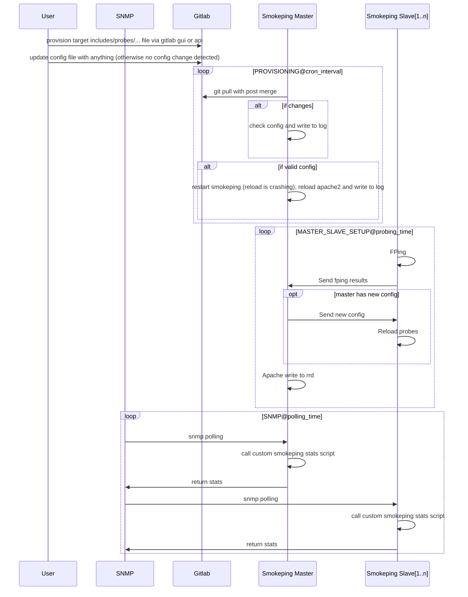

# Implementation



* NGINX/APACHE/SMOKEPING setup
    * smokeping uses cgi to display the graphs
    * apache has native cgi implementation
    * nginx does not have native cgi implementation and the GUI was very slow with nginx + smokeping

* MASTER has the following files (check smokeping docs for details):
    * slave and slave_secrets
        * specific slave config (display color and so on)
        * password
    * probes:
        * probe process - will run a process for every probe but not the fping
            * will not scale very well - memory is not really distributed among slaves
        * they consume memory so we should not define and infinte number
    * targets
        * hosts to ping
        * assigned to probes
            * if too many probes/targets fping will take longer than smokeping databse step and will loose results
            * need to keep time(probes/targets)<database_step
            * currently using 200 targets/probe
    * rrds
        * rrds are preallalocated - meaning that when new target is added an rrd will be added so you can know exactly how much storage you need
        * when targe is removed rrd is not deleted - need to create a cleanup script for this
        * storage is also not very well distributed

* SLAVE will:
    * if using @includes in master `config` file make sure you make some change (comments or timestamp) otherwise change will not be detected 
    * get config from master and start probes that are configured for him only
    * master and slave config will compare config timestamps and detect changes - if timestampt differs smokeping slave is reloaded

# Scalability

## Master Slave setup
Current master holds each rrd and a process for every probe.
This means that master still requires a lot of memory and storage so this is not very scalable.
It seems like only CPU is distributed to the slaves because fping is running on the slaves and not on the master.
Check below the current master usage:

## System Usage
```
[zsombor@monitoring-1-adm:/etc/smokeping]$ grep "host" Targets_Sites/* | wc -l
5320
[zsombor@monitoring-1-adm:/etc/smokeping]$ free -h
               total        used        free      shared  buff/cache   available
Mem:           125Gi       2.9Gi       121Gi       7.0Mi       1.6Gi       122Gi
Swap:          118Gi       5.3Gi       113Gi
[zsombor@monitoring-1-adm:/etc/smokeping]$ du -sh /var/lib/smokeping/
3.3G    /var/lib/smokeping/
```

This means that for 30.000 hosts to ping we need around 3x6=18Gb RAM and 3.3x6=19.6Gb storage.
